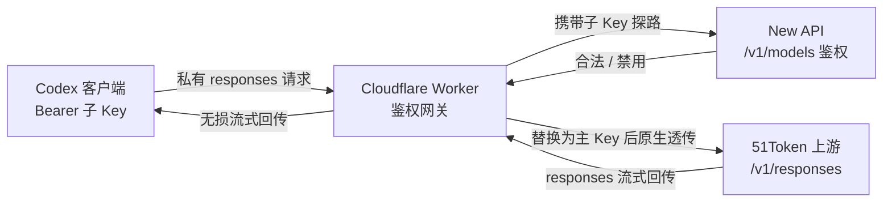

# Codex 接入代理与权限分发架构设计文档

## 1. 业务背景与核心痛点

在使用 Codex 客户端并尝试进行 API Key 分发时，面临以下特殊业务背景：

- **资源限制**：持有上游（51Token）的主 API Key，但无上游后台流量监控权限；只能通过自建 New API 尝试进行额度分发与监控。
- **协议壁垒（The Impossible Triangle）**：
  1. **Codex 客户端**：强校验其私有的 `responses` 协议，如果接收到标准 OpenAI 数据流，会引发流解析失败（`stream disconnected before completion`）。
  2. **New API 计费系统**：强依赖标准 OpenAI `chat/completions` 协议及 `messages` 数据结构。如果不做转换，网关无法解析请求并进行 Token 计费（报错 `messages is required`）。
  3. **上游服务商**：严格根据请求体协议返回对应流式格式。

**结论**：在不修改 Codex 源码的前提下，“通过网关进行精准 Token 计费”与“保持协议兼容不断流”在现阶段是互斥的。

## 2. 最终架构：鉴权网关模式（Auth-Gateway）

经过多轮调试，最终采用 **“Cloudflare Worker 作为鉴权分离路由”** 的架构。

核心思想：**放弃请求体的内容级代理（不走计费通道），仅做鉴权级代理。**

- **控制权面（New API）**：作为 Identity Provider（身份验证器），只负责验证分发出去的子 Key 是否合法、是否被禁用。
- **数据平面（Worker & 51Token）**：Worker 在鉴权通过后，直接将携带私有协议的原始请求透传给上游，确保 Codex 解析器不崩溃。

## 3. 请求链路图解

1. **发起请求**：Codex 客户端携带 `Authorization: Bearer <子Key>` 向 Cloudflare Worker 发起请求。
2. **探路鉴权（Auth Check）**：Worker 拦截请求，将 `<子Key>` 携带至 New API 的 `/v1/models` 接口（该接口不消耗 Token 且支持秒级响应）。
   - **判断**：如果 Key 在 New API 后台被禁用，返回 401/403，Worker 立即切断连接，Codex 报错并停止运行。
3. **凭证替换**：若鉴权通过，Worker 剥离 `<子Key>`，在请求头中注入 `<51Token主Key>`。
4. **原生透传**：Worker 保持 `Host` 以外的所有请求头和请求体不变，将流量直接转发至 `https://api.upit.top/v1/responses`。
5. **无损回流**：上游返回的 `responses` 私有协议流，经由 Worker 原封不动地流式传回给 Codex，完美兼容。



## 4. 核心代码与配置

### 4.1 Cloudflare Worker 实现

```javascript
export default {
  async fetch(request, env) {
    if (request.method !== 'POST') return new Response('Not Allowed', { status: 405 });

    // 1. 获取客户端传来的子 Key，例如在 New API 创建的 test1。
    const authHeader = request.headers.get('Authorization');

    // 2. 利用 New API 的模型列表接口进行轻量级鉴权。
    const checkAuth = await fetch('https://zhu592837154-newapi.hf.space/v1/models', {
      headers: { 'Authorization': authHeader }
    });

    // 3. 权限阻断：如果 Key 被禁用，直接返回 401。
    if (!checkAuth.ok) {
      return new Response('Unauthorized: API Key has been disabled or is invalid.', { status: 401 });
    }

    // 4. 鉴权通过，准备请求上游。这里填入拥有实际底层请求权限的主 Key。
    const master51TokenKey = 'sk-xxxxxxxxxxxxxxxxxxxxxxxx';

    const targetUrl = 'https://api.upit.top/v1/responses';
    const newHeaders = new Headers(request.headers);

    // 替换为上游所需的主 Key，并清理可能导致代理失败的 Host。
    newHeaders.set('Authorization', `Bearer ${master51TokenKey}`);
    newHeaders.delete('Host');

    // 5. 原生透传，保留原始私有协议请求体。
    const response = await fetch(targetUrl, {
      method: 'POST',
      headers: newHeaders,
      body: request.body
    });

    // 6. 流式透传，防止客户端协议解析崩溃。
    return new Response(response.body, {
      status: response.status,
      headers: response.headers
    });
  }
};
```

> 生产环境建议将 `master51TokenKey` 放入 Cloudflare Worker 的环境变量或 Secret 中，不要写死在脚本源码里。

### 4.2 Codex 客户端配置（`.codex`）

需确保底层协议校验配置正确，指向 Worker 代理地址。

```toml
[model_providers.custom]
approval_policy = "on-request"
sandbox_mode = "workspace-write"
web_search = "live"
name = "OpenAI"
# 指向部署好的 Cloudflare Worker 路由地址
base_url = "https://hidden-cloud-41fb.592837154.workers.dev/v1"
# 必须锁定此协议，不可改为 openai，否则引起内部解析崩溃
wire_api = "responses"
```

## 5. 方案优缺点总结

### 收益（Pros）

- **零报错完美运行**：完美绕过了 Codex 对闭源协议的硬编码校验。
- **绝对的控制权**：成功实现了 API Key 的多租户分发。通过 New API 后台可以随时实现“一键断网”级别的子 Key 权限管控。
- **超低延迟**：Cloudflare Worker 边缘节点 + 轻量级 `/v1/models` 探路，对对话延迟的增加几乎可以忽略不计。

### 妥协（Cons）

- **流量计费盲区**：由于请求绕过了 New API 的 `/v1/chat/completions` 标准计费路由，New API 后台无法统计各子 Key 消耗的具体 Token 数量。这是在当前协议限制下，为保障可用性做出的必要妥协。

## 6. 后续优化方向

- 将 Worker 中的上游主 Key 改为 Secret 注入，避免任何形式的源码泄露风险。
- 在 Worker 层补充最小访问日志，例如子 Key 标识、请求时间、上游状态码、异常原因，用于粗粒度审计。
- 为 New API 鉴权接口增加短 TTL 缓存，在频繁会话中进一步降低鉴权探路延迟。
- 如未来 New API 支持 `responses` 协议解析与计费，可重新评估“内容级代理 + 精准 Token 计费”的架构。
